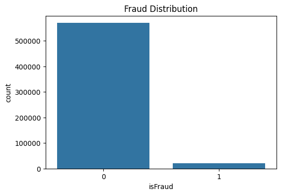
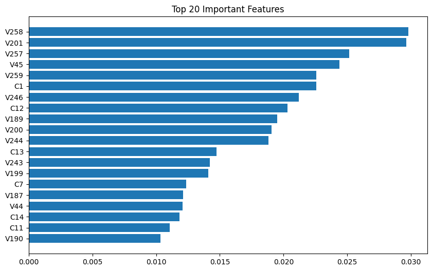
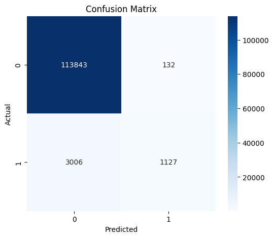
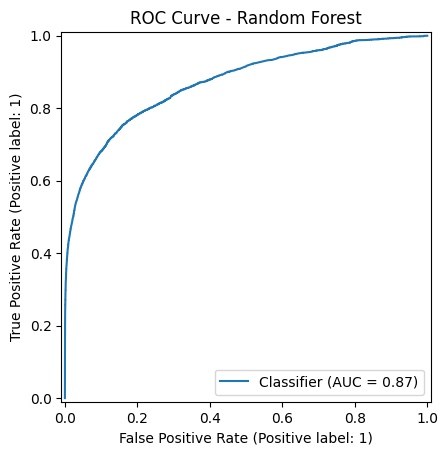
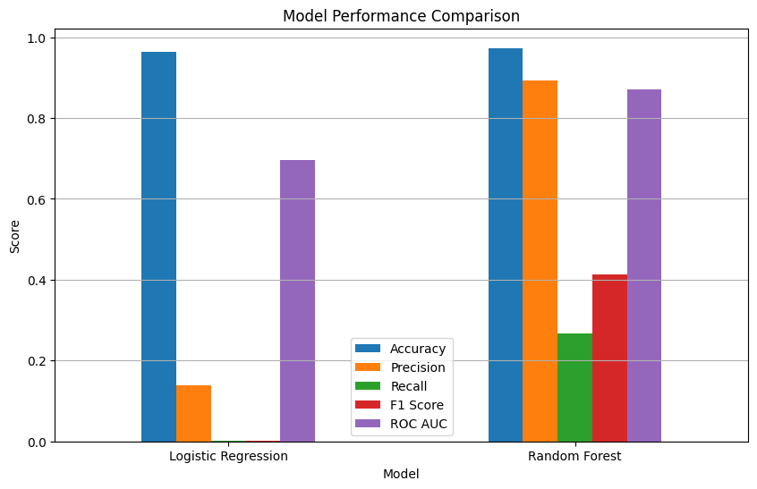

# Retail Banking Risk & Fraud Analytics Platform

## Project Overview

Financial fraud causes billions of dollars in losses every year. This project develops an end-to-end machine learning pipeline to detect fraudulent banking transactions using the IEEE-CIS Fraud Detection dataset.

The project includes data preprocessing, exploratory data analysis, feature engineering, model building, model comparison, visualization, and model optimization.

---

## Business Problem

Traditional fraud detection systems often struggle to identify complex fraudulent transaction patterns.

The objective of this project is to build a machine learning model capable of accurately identifying fraudulent transactions while minimizing false positives.

---

## Dataset

Dataset: IEEE-CIS Fraud Detection

Total Transactions: 590,540

Features: 429

Target Variable:

- isFraud
    - 0 → Legitimate Transaction
    - 1 → Fraudulent Transaction

---

## Tech Stack

- Python
- Pandas
- NumPy
- Matplotlib
- Seaborn
- Scikit-learn
- Joblib
- Jupyter Notebook

---

## Project Workflow

Data Understanding

↓

Data Preprocessing

↓

Exploratory Data Analysis

↓

Feature Engineering

↓

Feature Selection

↓

Model Building

↓

Model Comparison

↓

Model Optimization

↓

Final Fraud Detection Model

---

## Machine Learning Models

- Logistic Regression
- Random Forest

---

## Evaluation Metrics

- Accuracy
- Precision
- Recall
- F1 Score
- ROC-AUC
- Precision-Recall Curve
- Confusion Matrix

---

## Folder Structure

```text
Retail-Banking-Risk-Fraud-Analytics/
│
├── docs/
├── notebooks/
├── outputs/
│   ├── final_dataset.pkl
│   └── fraud_detection_model.pkl
├── screenshots/
├── README.md
├── requirements.txt
└── .gitignore
```
---

## Future Improvements

- XGBoost
- LightGBM
- Hyperparameter Tuning
- SHAP Explainability
- Model Deployment using Streamlit

---

## Author

**Md Aaris**

Computer Science Engineering Student

Aspiring Data Analyst & Machine Learning Engineer

## Project Screenshots

### Fraud Distribution


### Feature Importance


### Confusion Matrix


### ROC Curve


### Model Comparison
